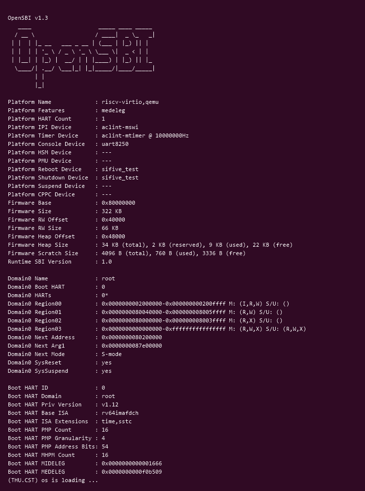
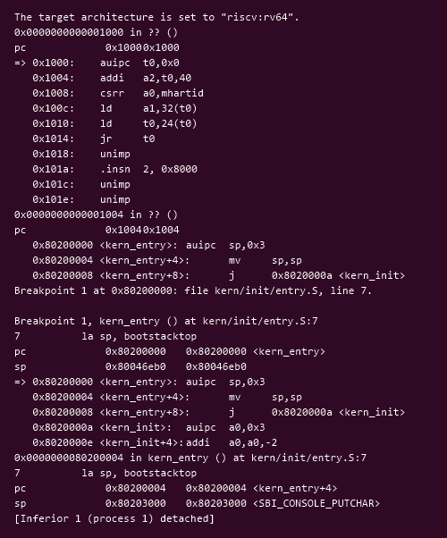

# 操作系统实验报告

## 实验基本信息

| 项目 | 内容 |
|------|------|
| **实验名称** | Lab 1: 比麻雀更小的麻雀（最小可执行内核） |
| **小组成员** | 2412796-杨斯源（组长）、2413628-黄乐仁、2410868-孙锘梵 |
| **完成日期** | [YYYY-MM-DD] |

### 小组分工

练习如何分工？

| 成员 | 负责的练习/模块 |
|------|----------------|
| 2412796-杨斯源（组长） | [待定] |
| 2413628-黄乐仁 | [待定] |
| 2410868-孙锘梵 | [待定] |

实验报告如何分工？

---

## 一、实验目的

本实验的主要目的是：

1. 理解一个操作系统内核从"加电"到"跑起来"的完整启动链路：RISC-V 硬件复位 → OpenSBI 固件 → 内核入口，弄清固件与内核各自负责什么、控制权如何交接。
2. 掌握用链接脚本（linker script）描述内核内存布局的方法，理解 `.text` / `.rodata` / `.data` / `.bss` / stack / heap 各段的作用与排布，以及为什么需要自己指定链接脚本而不能用 `ld` 的默认脚本。
3. 掌握将 C 与汇编源码交叉编译、链接成可被模拟器加载的内核镜像（ELF → `objcopy` → 纯二进制 `ucore.img`）的流程。
4. 理解内核在没有任何现成运行时库可依赖的前提下，如何借助 OpenSBI 提供的 SBI 服务自底向上搭出格式化输出能力。
5. 熟练使用 QEMU + GDB 调试内核启动流程，掌握 `make debug` / `make gdb`、断点、单步、查看寄存器与内存等基本手段。

---

## 二、实验环境

| 成员 | AI 编程工具 | 底层模型 | 备注 |
|------|------------|---------|------|
| [学号1-姓名1] | [例如：Claude Code（终端 Agent） / Cline（VS Code 插件）] | [例如：Claude Sonnet 5 / DeepSeek-V4-Flash] | [可选：特殊配置等] |
| [学号2-姓名2] | | | |
| [学号3-姓名3] | | | |

**运行环境：**

| 组件 | 版本 / 包名 |
|------|-------------|
| 操作系统 | Ubuntu 24.04.5 LTS（WSL2） |
| 交叉编译器 | `riscv64-unknown-elf-gcc` 15.1.0 |
| 二进制工具 | `riscv64-unknown-elf-ld` / `objcopy` / `objdump`（同一工具链） |
| 工具链位置 | `~/riscv-lab/riscv-elf-toolchains/bin`（已加入 `PATH`） |
| 模拟器 | `qemu-system-riscv64` 8.2.2（apt 包 `qemu-system-misc`） |
| 调试器 | `riscv64-unknown-elf-gdb` 16.3.90（`target remote localhost:1234`） |

**说明：**

- **AI 编程工具**：指具体使用的终端工具、编辑器插件、桌面应用或浏览器界面
- **底层模型**：指该工具使用的大语言模型及版本

---

## 三、实验整体逻辑分析

### 2.1 本章节的逻辑主线

本章围绕 **"操作系统是如何启动的"** 这一核心问题展开，最终交付物是一个"比麻雀更小的麻雀"——一个几千行 ucore 被剥到只剩下骨架的**最小可执行内核**：它能被 QEMU 加载、在 64 位 RISC-V 上真正执行、向屏幕输出一行 `(THU.CST) os is loading ...`，然后进入死循环。

整章要解决的问题是：**如何让一段我们自己写的代码，在没有任何操作系统支撑的裸机上获得控制权，并具备最基本的输出能力。** 这条链路被拆成"固件 → 引导 → 内核"三级接力：

1. RISC-V 硬件加电后从复位地址取指，跑的是固化在主板/固件里的代码，不是我们的内核；
2. OpenSBI 作为 M 模式的固件完成最底层硬件初始化，并把我们的内核加载到约定地址 `0x80200000`；
3. OpenSBI 跳转到 `0x80200000`，控制权移交内核，内核从 `kern_entry` 开始执行。

理解这条链路的关键在于两点：**控制权在哪一刻、以什么方式交接**，以及**内核在交接的瞬间处于什么状态**（没有栈、没有运行时库、只知道自己在内存中的位置）。

### 2.2 功能的逐步实现

本章按如下顺序逐步实现，每一步都为下一步提供必要前提：

1. 首先用**链接脚本描述内存布局**（`tools/kernel.ld`，`BASE_ADDRESS = 0x80200000`）。
   → 为什么首先做这个？因为内核必须"知道自己会被加载到哪里"，各段才能被正确排布；而 `ld` 的默认链接脚本是为"运行在现有操作系统之上的应用程序"设计的，不适合链接内核。同时链接脚本通过 `ENTRY(kern_entry)` 规定了程序入口点，这是后续所有工作的锚点。

2. 接着编写**内核入口汇编，建立内核栈**（`kern/init/entry.S` 中的 `kern_entry`：`la sp, bootstacktop` 后 `tail kern_init`）。
   → 为什么接着做这个？OpenSBI 跳转过来时并没有为我们准备一个可用的内核栈，而 C 语言函数调用、局部变量、保存寄存器都必须依赖栈。所以必须先用几条汇编指令把栈立起来，才能安全地进入 C 代码。

3. 然后把**源码交叉编译并链接成内核镜像**（`make`：`riscv64-unknown-elf-gcc` 编译 → `ld` 按链接脚本链接成 `bin/kernel` → `objcopy` 剥成纯二进制 `bin/ucore.img`）。
   → 为什么然后做这个？因为模拟器需要一个纯粹的二进制镜像（不带 ELF 头部等元信息）才能按约定加载到 `0x80200000`；这一步把"我们的代码"变成"OpenSBI 能加载的东西"。

4. 接着由**OpenSBI 完成加载与跳转**，把控制权交给 `0x80200000`。
   → 为什么然后做这个？这一步不在我们编写的代码里，但它是启动链上必不可少的一环。理解了它，才能解释为什么内核的第一条指令"凭空"开始执行，也才能为练习 2 的 GDB 断点位置（`b *0x80200000`）提供依据。

5. 最后在 C 语言内核入口 `kern_init` 中**清理 `.bss` 段并输出一行信息**（`memset(edata, 0, end - edata)` 后 `cprintf(...)`），`cprintf` 最终通过 `ecall` 请求 SBI 的 `console_putchar` 完成字符输出。
   → 为什么最后做这个？前面几步解决了"代码能跑起来"，这一步解决的才是"能看到结果"。而由于内核没有标准库，`memset`、`cprintf` 都必须自己实现，输出还要自下而上穿过 `console_putc` → `sbi_call` → `ecall` 进入 M 模式，这才形成"能看见"的最小闭环。

至此，"加电 → 固件 → 内核 → 输出"这条链完整打通，也为后续实验（lab2 起的物理内存、页表、中断等）提供了可以持续扩展的起点。

---

## 四、实验内容与实现

### 练习1：理解内核启动中的程序入口操作

**负责人：** [学号-姓名]

**题目：** 阅读 `kern/init/entry.S` 内容代码，结合操作系统内核启动流程，说明指令 `la sp, bootstacktop` 完成了什么操作，目的是什么？`tail kern_init` 完成了什么操作，目的是什么？

#### 相关源码

`kern/init/entry.S`：

```asm
.section .text,"ax",%progbits
    .globl kern_entry
kern_entry:
    la sp, bootstacktop
    tail kern_init

.section .data
    .align PGSHIFT
    .global bootstack
bootstack:
    .space KSTACKSIZE
    .global bootstacktop
bootstacktop:
```

`tools/kernel.ld` 中通过 `ENTRY(kern_entry)` 指定入口点，并把 `.text.kern_entry` 放在 `.text` 段的最开头；内核加载基址为 `BASE_ADDRESS = 0x80200000`。

#### 解答

**（1）`la sp, bootstacktop` 完成的操作与目的**

**完成的操作：** `la`（load address）是 RISC-V 汇编的一条**伪指令**，用于把一个符号的地址装入寄存器。它会被汇编器展开为两条真实指令：

```asm
auipc sp, %pcrel_hi(bootstacktop)   # 取 bootstacktop 相对当前 PC 的高位偏移
addi  sp, sp, %pcrel_lo(bootstacktop)  # 补上低位偏移
```

因此这条指令的实际效果是：**把符号 `bootstacktop` 的绝对地址写入栈指针寄存器 `sp`。**

**目的：为即将执行的 C 代码建立内核栈。** 具体来说：

- `bootstack` 是定义在 `.data` 段中的一个大小为 `KSTACKSIZE` 字节的数组，`bootstacktop` 紧跟在它之后，位于这段空间的高地址端。RISC-V 的栈**从高地址向低地址增长**，把 `sp` 指向 `bootstacktop`，就相当于得到了一个"栈顶为高地址、内容为空"的栈，后续函数调用压栈时会向低地址方向增长，正好落在 `bootstack` 预留的空间里，不会踩到别的数据。
- 之所以**必须**在这里设置栈，是因为 OpenSBI 执行 `tail`/跳转把控制权交给 `0x80200000` 时，并没有为内核准备一个可用的栈；而接下来的 C 代码（`kern_init` 及其调用的 `memset`、`cprintf`）需要保存返回地址、局部变量和 callee-saved 寄存器，这些都依赖栈。所以这是进入 C 世界前**必须补上的一步基础设施**。
- 另外 `.align PGSHIFT` 保证 `bootstack` 按页对齐，栈的对齐也满足 RISC-V ABI 要求。

**（2）`tail kern_init` 完成的操作与目的**

**完成的操作：** `tail` 同样是**伪指令**，表示"尾调用"，展开为：

```asm
auipc t1, %pcrel_hi(kern_init)
jalr  x0, t1, %pcrel_lo(kern_init)
```

关键在于 `jalr` 的**目标寄存器是 `x0`（即零寄存器 `zero`）**。`jalr` 的语义是"跳转到目标地址，同时把返回地址（下一条指令的地址）写入指定的寄存器"；写入 `x0` 意味着**返回地址被丢弃**。所以这条指令的效果是：**跳转到 `kern_init`，且不保存返回地址。**

**目的：把控制权从汇编入口移交给 C 语言编写的内核入口 `kern_init`。** 具体来说：

- 这是"汇编阶段"与"C 阶段"的分界线。`kern_entry` 的使命只有两件事——立好栈、跳到 C 代码；栈立好之后，真正干活的是 `kern_init`。
- 之所以用 `tail` 而不是普通的 `call`，是因为 `kern_init` 被声明为 `__attribute__((noreturn))`，函数体最后是 `while (1);`，**永远不会返回**。既然后面没有代码需要"回来"执行，就没必要在刚刚建立的空栈上压入一个永远不会用到的返回地址帧；用 `tail` 把这个"不再返回"的语义明确表达出来，同时不浪费栈空间。
- 从调用栈的角度看，这也让内核的初始调用栈最干净：`kern_init` 就是最外层，而不是"被 `kern_entry` 调用"。

#### 实现迭代过程

本练习为阅读分析题，不涉及代码修改与 AI 生成代码，无迭代过程。相关分析过程与使用的提示词见 `prompt.md`。

---

### 练习2：使用GDB验证启动流程

**负责人：** [学号-姓名]

**题目：** 为了熟悉使用 QEMU 和 GDB 的调试方法，请使用 GDB 跟踪 QEMU 模拟的 RISC-V 从加电开始，直到执行内核第一条指令（跳转到 `0x80200000`）的整个过程。通过调试，请思考并回答：RISC-V 硬件加电后最初执行的几条指令位于什么地址？它们主要完成了哪些功能？请在报告中简要记录你的调试过程、观察结果和问题的答案。

#### 调试过程

**（1）编译内核并启动调试环境**

先编译出内核镜像，再用 `make debug` 启动 QEMU。该目标在启动 QEMU 时会加上 `-S`（虚拟 CPU 启动后立即暂停，不执行任何指令）和 `-s`（在 1234 端口开放 GDB 调试桩）两个参数，因此 QEMU 起来后会停在"加电的第一步"之前，等待 GDB 连接：

```bash
make            # 编译：gcc → ld → objcopy，产出 bin/ucore.img
make debug      # 启动 QEMU，CPU 暂停，开放 gdb 端口 1234
```

**（2）另开一个终端连接 GDB**

```bash
make gdb
```

该目标等价于：

```bash
riscv64-unknown-elf-gdb -ex 'file bin/kernel' -ex 'set arch riscv:rv64' -ex 'target remote localhost:1234'
```

连接成功后可先查看复位后的初始状态：

```gdb
(gdb) info registers pc
```

**（3）跟踪从复位到内核的完整过程**

按指导书提示的三个阶段操作，避免在固件里单步跟过成千上万条指令：

```gdb
# 阶段一：CPU 从复位地址 0x1000 开始执行
(gdb) x/10i 0x1000          # 查看复位处的指令
(gdb) si                    # 单步几条，观察最初的几条指令做了什么
(gdb) info registers pc

# 阶段二：查看内核在内存中的状态，并在控制权移交处下断点
(gdb) x/3i 0x80200000       # 复位时刻该地址处的内容
(gdb) b *0x80200000

# 阶段三：让固件交出控制权，观察移交
(gdb) continue              # 应命中 0x80200000，即 kern_entry
(gdb) info registers pc sp  # 记录 pc 与 sp
(gdb) x/5i $pc              # 确认第一条指令是 la sp, bootstacktop
```

> **须知：指导书建议的 `watch *0x80200000` 在本实验环境中不会触发。**
>
> 指导书提示"可以使用 `watch *0x80200000` 观察内核加载瞬间"。实测该硬件监视点在 25 秒内始终未命中。原因是：使用 `-kernel`（以及原来的 `-device loader`）启动时，**内核镜像是 QEMU 在机器初始化阶段就写入内存的**，并不是由 OpenSBI 在运行过程中加载。因此在 GDB 连接上的那一刻（CPU 已被 `-S` 暂停在复位状态），`0x80200000` 处已经存放了完整的内核指令，此后不会再发生对该地址的写入，监视点自然无从触发。
>
> 所以本实验改用 `b *0x80200000` 断点来验证控制权移交，效果等价且可靠。

#### 观察结果

> 以下内容需在实验环境中实际运行后填写，并附对应截图到 `report/images/`。

| 观察点 | 记录 |
|--------|------|
| 复位后 `pc` 的初值 | [待实测：`info registers pc` 的输出] |
| 复位地址处前 10 条指令的地址与内容 | [待实测：`x/10i 0x1000` 的完整输出] |
| 这批指令占据的地址区间 | [待实测：由上一行结果推断] |
| 内核在复位时刻是否已在 `0x80200000` | [待实测：`x/3i 0x80200000` —— 用于验证"内核由 QEMU 预先加载"这一结论] |
| 断点 `b *0x80200000` 命中时的 `pc` 与首条内核指令 | [待实测：应为 `pc = 0x80200000`，首条指令 `auipc sp,0x3`，即 `la sp, bootstacktop`] |
| `sp` 在 `la sp, bootstacktop` 执行前后的值 | [待实测：`info registers sp`；执行后应为 `bootstacktop` 的地址] |

#### 问题解答

**问题：RISC-V 硬件加电后最初执行的几条指令位于什么地址？它们主要完成了哪些功能？**

[待实测后作答。预期结论框架：]

- **地址**：加电后 CPU 从**复位地址**取指，在 QEMU 的 `virt` 机器上是 `0x1000`。这段代码并不是内核的一部分，而是固件（初始化固件 / OpenSBI）的入口代码。
- **功能**：复位后的最初几条指令做的是"让机器达到可以执行固件主体的最小状态"，主要包括：[待实测确认后补全，例如设置初始栈指针、保存/传递必要的启动参数（如 hart id、设备树地址 `a0`/`a1`）、然后跳转到固件主体（OpenSBI）所在的 `0x80000000`]。真正的硬件初始化（如中断控制器、时钟、串口等）与"把内核加载到 `0x80200000`"是由固件主体完成的，最后固件跳转到 `0x80200000`，控制权正式移交给内核。

---

## 五、测试与验证

**编译与运行（`make qemu`）：**

预期输出为 `(THU.CST) os is loading ...`，随后内核进入死循环（表现在终端上就是停在输出之后不再有新的输出，`Ctrl+A` 再按 `x` 退出 QEMU）。



**GDB 调试过程截图：**



> 说明：lab1 没有自动评分脚本。`Makefile` 中虽然保留了从 ucore 模板继承下来的 `grade` 目标，但它的实现是 `$(SH) tools/grade.sh`，而 **`tools/grade.sh` 并未随 lab1 代码发放**（`code/tools/` 下只有 `function.mk` 与 `kernel.ld`）；该目标引用的 `TOUCH_FILES := kern/trap/trap.c` 在本实验中同样不存在（lab1 无 `kern/trap/` 目录）。因此 `make grade` 无法运行，无法提供对应的测试截图。本实验的验证方式为：内核能被 QEMU 加载并正确输出启动信息（`make qemu`），以及通过 GDB 断点在 `0x80200000` 处验证控制权确实移交给内核（练习 2）。

---

## 六、实验总结与收获

### 对操作系统的理解

**1. 本实验中重要的知识点，及与 OS 原理中对应知识点的关系**

| 本实验中的知识点 | 对应 OS 原理中的知识点 | 含义、关系与差异 |
|------------------|------------------------|------------------|
| 复位地址与固件（OpenSBI）先于内核运行 | 引导加载程序（Bootloader）/ 固件 | 原理中通常讲 BIOS/UEFI + GRUB 的"固件 → 引导程序 → 内核"三级跳；本实验用 OpenSBI 扮演固件兼引导的角色。**关系**：同一设计哲学。**差异**：真实 PC 上引导链更长、有安全校验与更多硬件初始化；QEMU 里 OpenSBI 同时承担了固件与引导两件事，链条被压缩了。 |
| `BASE_ADDRESS = 0x80200000`、链接脚本描述内存布局 | 程序的装入与地址空间、链接与重定位 | 原理讲可执行文件如何被装入地址空间；本实验直接规定内核被装入的物理基址和各段顺序。**差异**：这是"裸机"场景，没有分页、没有虚拟地址，一切是物理地址。 |
| `kern_entry` 设置内核栈 | 进程/线程的栈、调用约定 | 原理中栈是进程上下文的一部分，由内核在创建进程时建立；本实验中栈是内核启动时用汇编亲手立起来的。**关系**：都是"C 代码运行的前提"。 |
| `.bss` 段清理（`memset(edata, 0, end - edata)`） | 未初始化数据段 / 零初始化 | 原理讲 `.bss` 不占文件空间、装入时需清零；本实验中因为内核无 runtime，必须自己显式清零。 |
| `cprintf` 经 `ecall` 调用 SBI `console_putchar` 输出 | 系统调用 / 特权级与陷入内核 | 原理讲用户态通过系统调用进入内核态获得服务；本实验是 S 模式内核通过 `ecall` 进入 M 模式请求固件服务，是同一套"特权级 + 陷入"机制的**更基础形态**。**差异**：这里的"系统调用"通向固件而非内核。 |
| 内核无标准库，需自实现 `memset`/`cprintf` | freestanding 环境 / 内核运行时自举 | 原理中内核自身提供运行时；本实验体会"什么都要自己造"的起点状态。 |

**2. OS 原理中很重要、但本实验没有对应上的知识点**

1. **虚拟内存与分页机制**：本实验全部使用物理地址，链接脚本直接规定物理装入地址，尚未涉及页表、地址翻译与 `MMU`；这要到 lab2、lab4 才展开。
2. **进程与线程的抽象**：本实验只有"内核自己"在跑，没有进程/线程概念，没有上下文切换，更没有用户态——特权级只用到 M/S 两级，U 模式尚未登场。
3. **中断与异常处理**：加电到内核启动的整个过程是顺序执行的，没有中断响应、没有陷入处理流程（`trapentry.S`、`trap.c` 在本实验中虽存在但未被真正使用）。
4. **并发与同步**：单核、单执行流、无中断，自然谈不上竞态、锁与信号量。
5. **文件系统与设备管理的抽象层**：输出只经最小路径直达 SBI，没有通用设备抽象、缓冲与文件概念。
6. **调度**：只有一条执行流，不存在"谁先上 CPU"的问题。

（可以看到，lab1 是"最小可执行内核"，它把 OS 的大部分机制都**故意剥掉了**，只留下最基本的启动与输出骨架——这正是后续各 lab 逐一补回来的内容。）

### AI 协作开发的经验

> [待补：结合本实验实际与 AI 协作的过程填写。]

---

